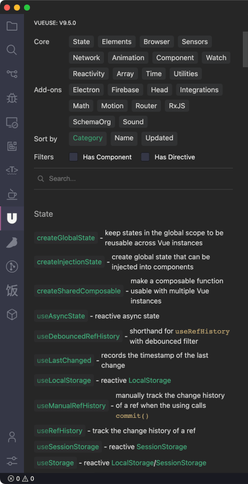
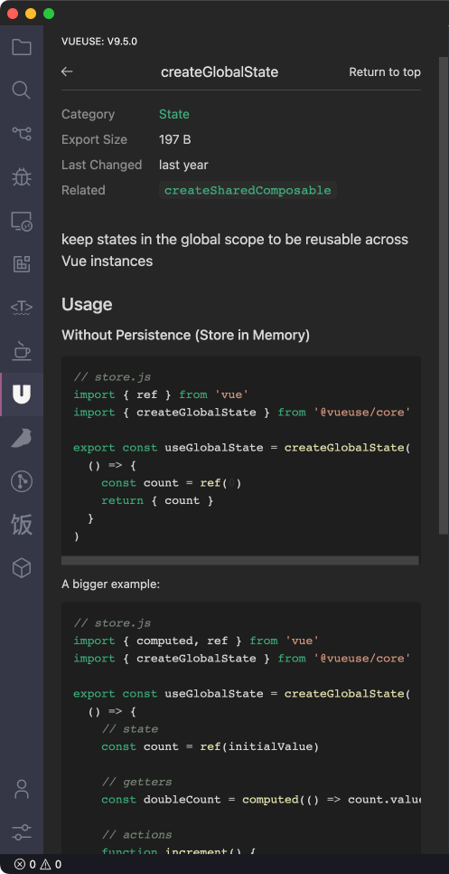

 

Browse VueUse Documentation in VS Code

 

## Features

- View functions in the side panel
- Search function
- Show documentation for each function
- Dark/Light mode

 

## License

MIT License © 2022 [YRM](https://github.com/yrming)